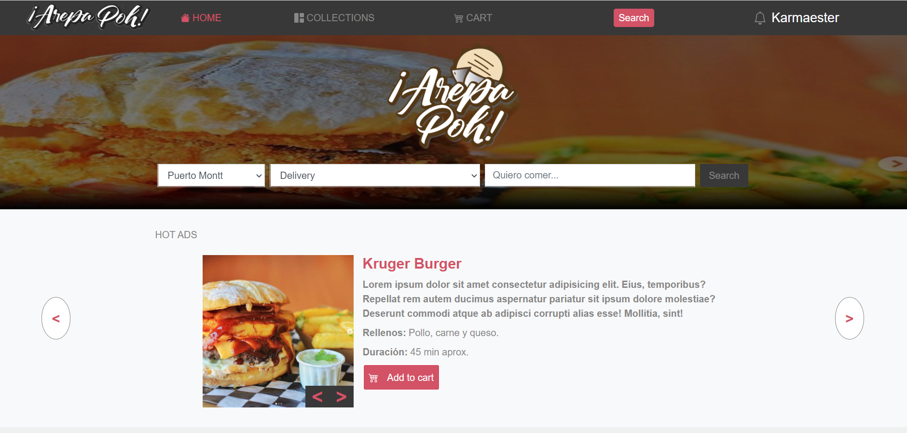
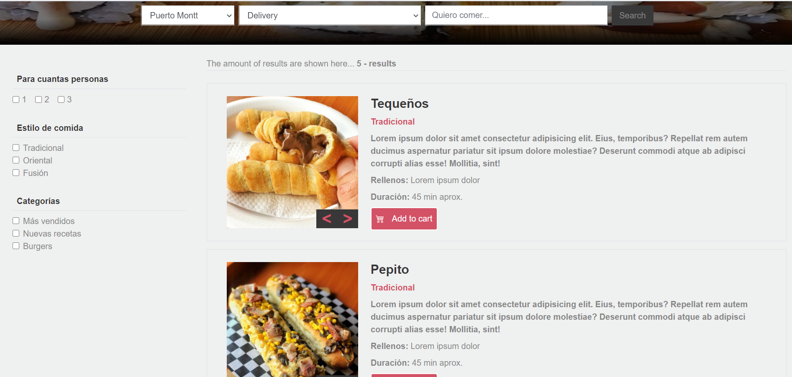

# Arepa Poh

> Made as the capstone project for the HTML/CSS module in the Microverse curriculum as a practice for web design and development with Sass and Bootstrap.

Main page

Search page

## Built With

- HTML5
- CSS3
- Sass
- Bootstrap

## Live Demo

[Live Demo Link](https://karmaester.github.io/Capstone-HTML-CSS/.)

## Author

👤 **karmaester**

- Github: [@githubhandle](https://github.com/karmaester)
- Twitter: [@twitterhandle](https://twitter.com/karmaendlich)
- Linkedin: [linkedin](https://www.linkedin.com/in/khristian-rojas/)

## 🤝 Contributing

Contributions, issues and feature requests are welcome!

Feel free to check the [issues page](https://github.com/karmaester/Capstone-HTML-CSS/issues).

## Show your support

Give a ⭐️ if you like this project!

## Acknowledgments

- Inspired on the Mohammed Awad ZATTIX design
• https://www.behance.net/gallery/24796463/ZATTIX

## 📝 License

This project is [MIT](lic.url) licensed.
